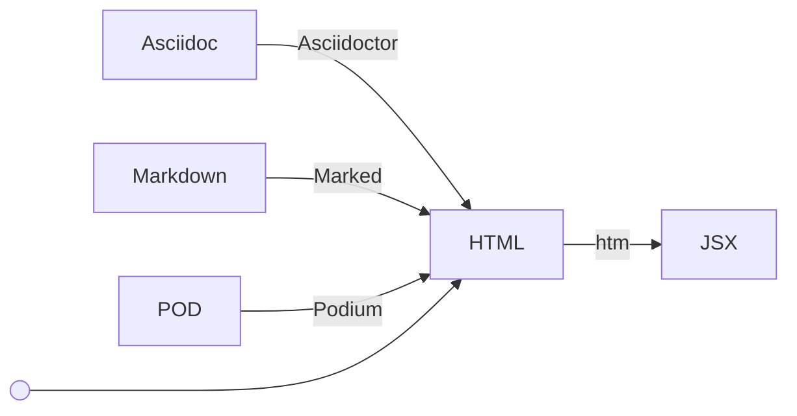

# unplugin-jsxify

## Architecture

This plugin constructs a pipeline that converts various markup languages into JSX components. It begins by transforming the input text into HTML and then passes the resulting HTML to the transpiler that converts HTML to JSX (htm). **By default, this plugin does not perform any transformations;** you must provide a JavaScript function that converts text to HTML in the form of `(src: string) => string`.



## Options and Default Values

```ts
Jsxify({
  // settings for default values
  default: {
    extensions: [], // to detect target files
    jsxImportSource: 'react', // to compile the HTML content to JSX components
    render: (src: string) => src // to compile the original content to HTML
  }
  /* EXAMPLE:
  html: {
    extensions: ['.html', '.htm'],
    render: (src: string) => src
  }
  // you can use any language!
  markdown: {
    extensions: ['.md'],
    render: (src: string) => marked.parse(src)
  }
  */
})
```

## Install

```bash
npm i unplugin-jsxify
```

<details>
<summary>Vite</summary><br>

```ts
// vite.config.ts
import Jsxify from 'unplugin-jsxify/vite'

export default defineConfig({
  plugins: [
    Jsxify({ /* options */ }),
  ],
})
```

Example: [`playground/`](./playground/)

<br></details>

<details>
<summary>Rollup</summary><br>

```ts
// rollup.config.js
import Jsxify from 'unplugin-jsxify/rollup'

export default {
  plugins: [
    Jsxify({ /* options */ }),
  ],
}
```

<br></details>


<details>
<summary>Webpack</summary><br>

```ts
// webpack.config.js
module.exports = {
  /* ... */
  plugins: [
    require('unplugin-jsxify/webpack')({ /* options */ })
  ]
}
```

<br></details>

<details>
<summary>Nuxt</summary><br>

```ts
// nuxt.config.js
export default defineNuxtConfig({
  modules: [
    ['unplugin-jsxify/nuxt', { /* options */ }],
  ],
})
```

> This module works for both Nuxt 2 and [Nuxt Vite](https://github.com/nuxt/vite)

<br></details>

<details>
<summary>Vue CLI</summary><br>

```ts
// vue.config.js
module.exports = {
  configureWebpack: {
    plugins: [
      require('unplugin-jsxify/webpack')({ /* options */ }),
    ],
  },
}
```

<br></details>

<details>
<summary>esbuild</summary><br>

```ts
// esbuild.config.js
import { build } from 'esbuild'
import Jsxify from 'unplugin-jsxify/esbuild'

build({
  plugins: [Jsxify({ /* options */ })],
})
```

<br></details>
